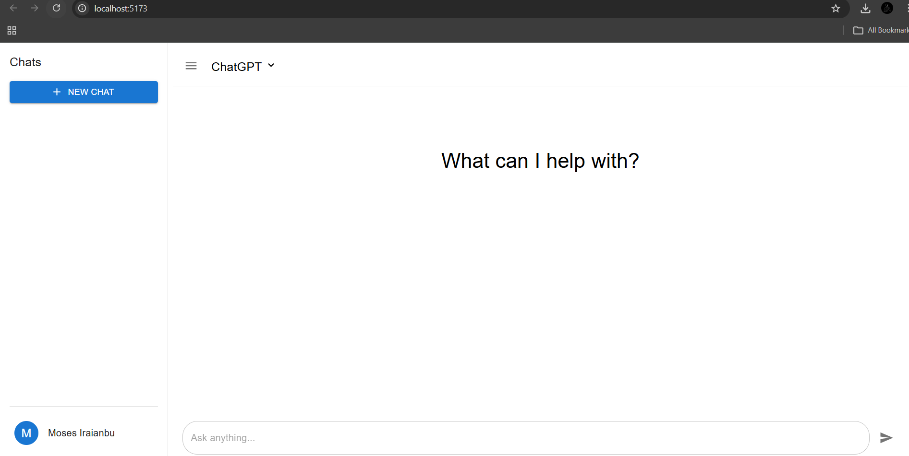
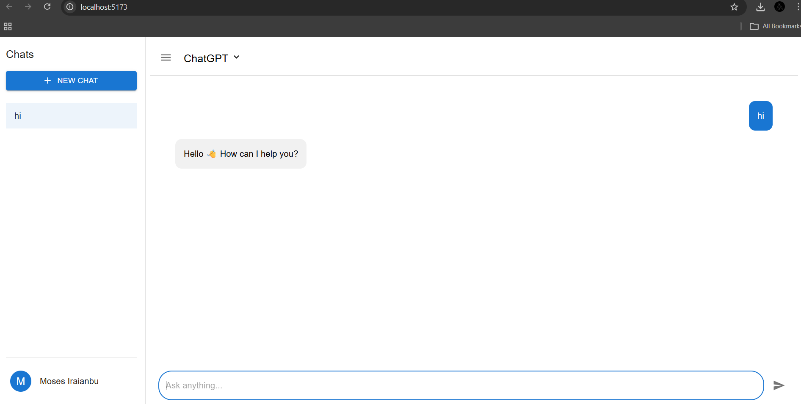
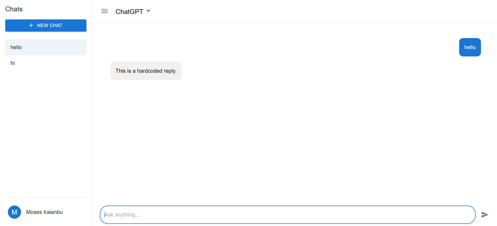

# 💬 ChatGPT UI Clone

A modern ChatGPT-style chat interface built using React and Material UI,
with unit testing powered by Vitest and React Testing Library.

------------------------------------------------------------------------
# 🔗 GitHub Repository:

https://github.com/MosesIraianbu7/ChatGptClone

---------------------------------------------------------------------

# 📌 Overview

This project is a frontend ChatGPT UI clone that demonstrates:

-   Component-based architecture
-   Chat state management
-   Sidebar with chat history
-   Conditional rendering
-   Event handling
-   Unit testing
-   Clean folder structure
-   Material UI styling

The application simulates a basic chatbot interaction with simple
response logic.

------------------------------------------------------------------------

# 🛠️ Tech Stack

## 🔹 Frontend

-   React -- Component-based UI development
-   Vite -- Fast development build tool
-   Material UI (MUI) -- UI component library
-   MUI Icons -- Icon components

## 🔹 Styling

-   MUI `sx` prop styling
-   Flexbox layout
-   Responsive structure

## 🔹 State Management

-   React `useState`
-   Props-based state sharing
-   Lifted state in `App.jsx`

## 🔹 Testing

-   Vitest -- Testing framework
-   React Testing Library (RTL) -- Component testing
-   Jest DOM -- Custom DOM matchers

------------------------------------------------------------------------

# 📸 Application Preview

## 🖥️ ChatGpt Preview

## 🖥️ Greeting Response 

## 🖥️ Multiple Chats

------------------------------------------------------------------------

# 📁 Project Structure

    .git
    node_modules
    public
    src
    │
    ├── assets
    │
    ├── components
    │   ├── Chat
    │   │   ├── ChatArea.jsx
    │   │   ├── ChatInput.jsx
    │   │   └── ChatMessages.jsx
    │   │
    │   ├── Layout
    │   │   ├── ChatHeader.jsx
    │   │   └── Sidebar.jsx
    │
    ├── tests
    │   └── App.test.jsx
    │
    ├── App.jsx
    └── main.jsx

------------------------------------------------------------------------

# 🧠 Application Architecture

## App.jsx

-   Stores all chats
-   Stores selected chat ID
-   Handles message sending
-   Controls sidebar visibility
-   Passes props to child components

## Sidebar.jsx

-   Persistent Drawer
-   Create new chat
-   Display chat list
-   Highlight active chat
-   Profile section

## ChatArea.jsx

-   Menu toggle button
-   ChatHeader
-   ChatMessages
-   ChatInput
-   Displays empty state when no messages

## ChatMessages.jsx

-   Renders message bubbles
-   User messages → Right aligned (Blue)
-   Bot messages → Left aligned (Grey)

## ChatInput.jsx

-   Handles input field
-   Send button
-   Enter key submission
-   Prevents empty messages

------------------------------------------------------------------------

# 💬 Chat Logic

  User Input       Bot Response
  ---------------- ------------------------------
  hi               Hello 👋 How can I help you?
  Any other text   This is a hardcoded reply.

------------------------------------------------------------------------

# 🧪 Testing

Testing is implemented using:

-   Vitest
-   React Testing Library
-   Jest DOM

File location:

    src/tests/App.test.jsx

## Test Cases Covered

1.  Initial render shows empty state message
2.  New Chat button is rendered
3.  Clicking New Chat creates a new chat
4.  Sending a message displays user + bot response
5.  Typing "hi" returns greeting response

------------------------------------------------------------------------

# 🚀 Installation

Install dependencies:

    npm install

Run development server:

    npm run dev

Run tests:

    npm run test

------------------------------------------------------------------------

# 👨‍💻 Author

Moses Iraianbu RS